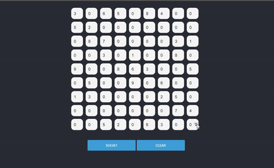
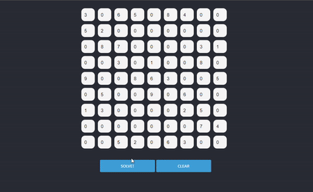

# ReactSudokuSolver
Simple React App that check if you're solving Sudoku in the right way. It can also solve it for you if you've got stuck! I always was bad in this game and this project motivated me to find and understand what I was doing wrong.

# Live demo is available at https://przemyslawsarnacki.github.io/ReactSudokuSolver/

#  App basic functionality

|Checking if you're right with solving sudoku|
|---|
||

|Solving Sudoku if you've got enough of it ;) |
|---|
||

